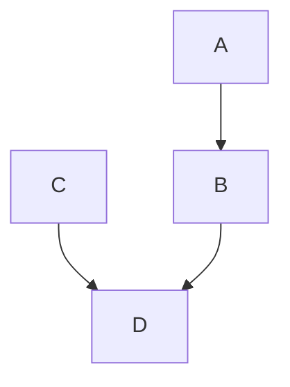

## Entrypoint of gh-pages

# Testing mermaid graph

This should create a svg image from the below mermaid graph and include it into the markdown with github actions.  
Needed for output on github-pages

