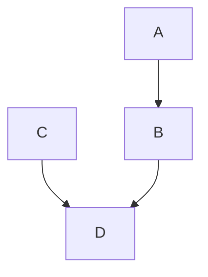

## Entrypoint of gh-pages

# Testing mermaid graph

**Simple 1-site testing of mermaid graphs**  
This should create a svg image from the below mermaid graph and include it into the markdown with github actions.  
Needed for output on github-pages

<!-- generated by mermaid compile action - START -->

  
Mermaid markup

<!-- generated by mermaid compile action - END -->
